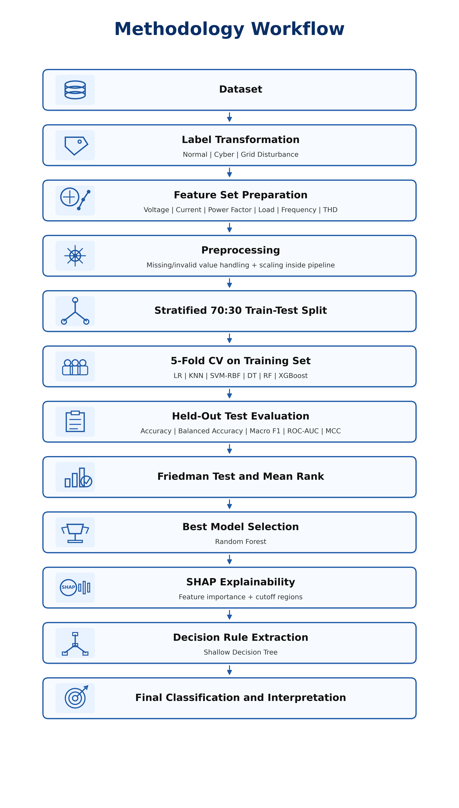

# Smart Grid Cyber-Physical Anomaly Classification

## Distinguishing Cyber-Induced Anomalies and Physical Disturbances in Smart Grids Using Interpretable Machine Learning

## Introduction

This repository accompanies an anonymous manuscript submitted for peer review. The proposed study presents an explainable machine learning framework for distinguishing cyber-induced anomalies from physical grid disturbances using operational smart-grid measurements. Accurate differentiation between cyber events and physical disturbances is essential for enhancing situational awareness, operational reliability, and decision support in modern cyber-physical power systems.

Unlike conventional anomaly detection methods that primarily focus on identifying abnormal events, the proposed framework explicitly distinguishes three operational states: **Normal**, **Cyber**, and **Grid Disturbance**. The framework integrates supervised machine learning, statistical validation, and explainable artificial intelligence (XAI) to provide accurate and interpretable cyber-physical event classification.

---

## 🔍 Key Contributions

- **Three-Class Cyber-Physical Classification:** A unified framework for distinguishing **Normal**, **Cyber**, and **Grid Disturbance** events using operational electrical measurements.

- **Comprehensive Machine Learning Evaluation:** Comparative assessment of Logistic Regression, KNN, SVM-RBF, Decision Tree, Random Forest, and XGBoost using stratified 5-fold cross-validation.

- **Statistical Performance Validation:** Friedman statistical test is employed to verify whether the observed performance differences among classifiers are statistically significant.

- **Explainable Artificial Intelligence:** SHAP-based feature attribution and interpretable decision rules are utilized to provide transparent explanations for model predictions.

- **High Classification Performance:** The proposed framework demonstrates strong predictive performance while maintaining model interpretability for smart-grid monitoring applications.

---

## Proposed Workflow

The overall workflow of the proposed explainable machine learning framework is illustrated below.

  

**Figure 1.** Overall workflow of the proposed framework for distinguishing cyber-induced anomalies and physical grid disturbances.

## Experimental Results

## Experimental Results

The proposed framework was evaluated using stratified 5-fold cross-validation. Random Forest achieved the best overall performance, followed closely by XGBoost and Decision Tree.

| Model | Accuracy | Balanced Accuracy | Macro F1 |
|:------|:--------:|:-----------------:|:--------:|
| **Random Forest** | **0.9912 ± 0.0056** | **0.9828 ± 0.0120** | **0.9881 ± 0.0077** |
| XGBoost | 0.9901 ± 0.0064 | 0.9823 ± 0.0123 | 0.9866 ± 0.0087 |
| Decision Tree | 0.9868 ± 0.0056 | 0.9825 ± 0.0090 | 0.9825 ± 0.0074 |
| KNN-5 | 0.9835 ± 0.0078 | 0.9643 ± 0.0168 | 0.9770 ± 0.0112 |
| Logistic Regression | 0.9802 ± 0.0082 | 0.9571 ± 0.0178 | 0.9721 ± 0.0119 |
| SVC-RBF | 0.9791 ± 0.0081 | 0.9548 ± 0.0175 | 0.9705 ± 0.0121 |

**Table 1.** Stratified 5-fold cross-validation performance of the evaluated classifiers.

---

## SHAP Explainability

*(SHAP Beeswarm and/or Dependence Plot will be inserted here.)*

---

## Code Availability

To preserve the integrity of the double-blind review process, the complete implementation is not publicly released at the time of submission.

Upon acceptance, this repository will be updated with:

- Complete source code
- Data preprocessing scripts
- Model training and evaluation pipeline
- SHAP analysis
- Reproducibility instructions
- Documentation
